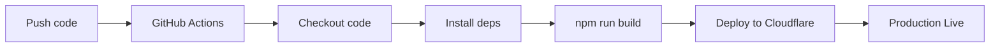
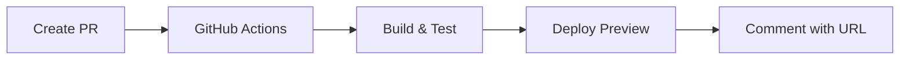

# 🔄 Configuration CI/CD - Guide Complet

## ✅ Option A : Déploiement Immédiat (COMPLÉTÉ)

**Statut** : ✅ **FAIT - v1.3.0 Déployée**

- **URL Production** : https://a51f4e6b.agentic-process-analyzer.pages.dev
- **Version Déployée** : v1.3.0 avec mode "Titre du Processus"
- **Date de Déploiement** : 2025-11-15
- **Statut API** : ✅ Fonctionnel (testé avec KYC)

---

## 🤖 Option B : CI/CD Automatique depuis GitHub

### Pourquoi le CI/CD ?

**Avantages** :
- 🚀 Déploiement automatique à chaque push sur `main`
- 🔍 Preview automatique pour chaque Pull Request
- ✅ Build validé avant merge
- 📊 Logs de déploiement dans GitHub Actions
- 🔄 Rollback facile si problème

### Étape 1 : Créer le Workflow GitHub Actions

Le workflow ne peut pas être poussé via l'API GitHub App. Vous devez le créer **manuellement** :

#### Option 1A : Via l'Interface Web GitHub (Recommandé)

1. **Allez sur votre repository** : https://github.com/Jaokimben/APA

2. **Créez le fichier workflow** :
   - Cliquez sur "Add file" → "Create new file"
   - Chemin : `.github/workflows/deploy.yml`
   - Collez le contenu ci-dessous
   - Commit avec message : "ci: Add Cloudflare Pages deployment workflow"

**Contenu du fichier `.github/workflows/deploy.yml`** :

```yaml
name: Deploy to Cloudflare Pages

on:
  push:
    branches:
      - main
  pull_request:
    branches:
      - main

jobs:
  deploy:
    runs-on: ubuntu-latest
    permissions:
      contents: read
      deployments: write
    
    name: Deploy to Cloudflare Pages
    
    steps:
      - name: Checkout repository
        uses: actions/checkout@v4
      
      - name: Setup Node.js
        uses: actions/setup-node@v4
        with:
          node-version: '18'
          cache: 'npm'
      
      - name: Install dependencies
        run: npm ci
      
      - name: Build project
        run: npm run build
      
      - name: Deploy to Cloudflare Pages
        uses: cloudflare/pages-action@v1
        with:
          apiToken: ${{ secrets.CLOUDFLARE_API_TOKEN }}
          accountId: ${{ secrets.CLOUDFLARE_ACCOUNT_ID }}
          projectName: agentic-process-analyzer
          directory: dist
          gitHubToken: ${{ secrets.GITHUB_TOKEN }}
          branch: main
          wranglerVersion: '3'
```

#### Option 1B : Via Git en Local

Si vous avez le projet cloné localement :

```bash
# Clone le repository (si pas déjà fait)
git clone https://github.com/Jaokimben/APA.git
cd APA

# Créez le dossier workflows
mkdir -p .github/workflows

# Créez le fichier deploy.yml avec le contenu ci-dessus
# (utilisez votre éditeur préféré)

# Commit et push
git add .github/workflows/deploy.yml
git commit -m "ci: Add Cloudflare Pages deployment workflow"
git push origin main
```

### Étape 2 : Configurer les Secrets GitHub

**IMPORTANT** : Le workflow nécessite 2 secrets pour fonctionner.

1. **Allez dans Settings** : https://github.com/Jaokimben/APA/settings/secrets/actions

2. **Ajoutez les 2 secrets** :

#### Secret 1 : CLOUDFLARE_API_TOKEN

**Nom** : `CLOUDFLARE_API_TOKEN`

**Comment obtenir le token** :
1. Allez sur : https://dash.cloudflare.com/profile/api-tokens
2. Cliquez sur "Create Token"
3. Utilisez le template : **"Edit Cloudflare Workers"**
4. Ou créez un custom token avec ces permissions :
   ```
   Account > Cloudflare Pages > Edit
   Zone > DNS > Edit (optionnel)
   ```
5. Cliquez sur "Continue to summary" → "Create Token"
6. **COPIEZ le token** (vous ne pourrez plus le voir après)
7. Collez-le dans GitHub Secret

#### Secret 2 : CLOUDFLARE_ACCOUNT_ID

**Nom** : `CLOUDFLARE_ACCOUNT_ID`

**Valeur** : `42f26f615d8977d2e673e75397f4d73b`

**Comment trouver votre Account ID** :
- URL Cloudflare Dashboard : `https://dash.cloudflare.com/<ACCOUNT_ID>`
- Workers & Pages > Overview
- Ou commande : `npx wrangler whoami`

### Étape 3 : Tester le Workflow

Une fois le workflow créé et les secrets configurés :

```bash
# Faites un petit changement
echo "# Test CI/CD" >> README.md

# Commit et push
git add README.md
git commit -m "test: trigger CI/CD workflow"
git push origin main
```

**Vérifiez le déploiement** :
- GitHub Actions : https://github.com/Jaokimben/APA/actions
- Le workflow "Deploy to Cloudflare Pages" devrait s'exécuter automatiquement

### Étape 4 : Vérifier le Déploiement

Une fois le workflow terminé (environ 2-3 minutes) :

1. **Check GitHub Actions** :
   - ✅ Toutes les étapes en vert
   - 📝 Logs disponibles

2. **Check Cloudflare Pages** :
   - Allez sur : https://dash.cloudflare.com
   - Workers & Pages > agentic-process-analyzer
   - Vous devriez voir le nouveau déploiement

3. **Testez l'URL** :
   ```bash
   curl https://agentic-process-analyzer.pages.dev
   ```

---

## 📊 Workflow CI/CD - Ce Qui Se Passe

### Sur Push vers `main`



**Étapes** :
1. ✅ Code pushed vers `main`
2. ✅ GitHub Actions détecte le push
3. ✅ Checkout du code
4. ✅ Installation des dépendances (`npm ci`)
5. ✅ Build du projet (`npm run build`)
6. ✅ Déploiement sur Cloudflare Pages
7. ✅ URL de production mise à jour

**Durée** : ~2-3 minutes

### Sur Pull Request



**Avantages** :
- 🔍 Preview de chaque PR
- ✅ Validation du build avant merge
- 💬 URL de preview dans les commentaires
- 🔄 Preview mis à jour à chaque commit

---

## 🔍 Monitoring et Logs

### GitHub Actions
- **URL** : https://github.com/Jaokimben/APA/actions
- **Logs détaillés** : Cliquez sur un workflow run
- **Re-run** : Possibilité de re-lancer si échec

### Cloudflare Pages Dashboard
- **URL** : https://dash.cloudflare.com
- **Analytics** : Trafic, requests, errors
- **Deployments** : Historique complet
- **Rollback** : Retour à une version précédente

---

## ❓ Troubleshooting

### Workflow ne démarre pas
- ✅ Vérifiez que le fichier est dans `.github/workflows/deploy.yml`
- ✅ Vérifiez la syntaxe YAML (indentation !)
- ✅ Vérifiez les permissions du repository

### "Unauthorized" Error
- ✅ Vérifiez `CLOUDFLARE_API_TOKEN` dans les secrets
- ✅ Régénérez le token si nécessaire
- ✅ Vérifiez les permissions du token

### "Project not found" Error
- ✅ Vérifiez `CLOUDFLARE_ACCOUNT_ID`
- ✅ Vérifiez que le projet existe sur Cloudflare
- ✅ Vérifiez le nom du projet : `agentic-process-analyzer`

### Build Fails
- ✅ Testez localement : `npm run build`
- ✅ Vérifiez les logs GitHub Actions
- ✅ Vérifiez les dépendances dans `package.json`

---

## 🎯 État Actuel vs État Futur

### 📍 État Actuel (Après Option A)
```
Code → Git → GitHub → (Manuel) → npm run deploy:prod → Cloudflare Pages
```

### 🚀 État Futur (Après Option B)
```
Code → Git → GitHub → (Automatique via Actions) → Cloudflare Pages
```

**Gain** :
- ⏱️ Pas besoin de déployer manuellement
- 🔄 Déploiement à chaque push
- 📊 Historique complet dans GitHub
- 🔍 Preview automatique des PRs

---

## 📝 Checklist Configuration CI/CD

- [ ] **Étape 1** : Créer `.github/workflows/deploy.yml`
  - [ ] Via interface web GitHub
  - [ ] Ou via Git local
  
- [ ] **Étape 2** : Configurer les secrets
  - [ ] `CLOUDFLARE_API_TOKEN` ajouté
  - [ ] `CLOUDFLARE_ACCOUNT_ID` ajouté
  
- [ ] **Étape 3** : Tester le workflow
  - [ ] Push un changement
  - [ ] Vérifier GitHub Actions
  - [ ] Vérifier déploiement Cloudflare
  
- [ ] **Étape 4** : Vérifier production
  - [ ] URL accessible
  - [ ] Fonctionnalités testées
  - [ ] Pas d'erreurs console

---

## 🎉 Résultat Final

Une fois configuré, vous aurez :

✅ **Déploiement automatique** sur chaque push  
✅ **Preview automatique** pour chaque PR  
✅ **Build validation** avant merge  
✅ **Historique complet** des déploiements  
✅ **Rollback facile** si problème  
✅ **Monitoring** via GitHub Actions + Cloudflare  

---

**Besoin d'aide ? Consultez** :
- 📚 `.github/SECRETS.md` : Guide détaillé des secrets
- 📖 `.github/CONTRIBUTING.md` : Guide de contribution
- 🐛 Issue templates : Bug reports et feature requests
- 💬 GitHub Issues : https://github.com/Jaokimben/APA/issues

---

**Le CI/CD transformera votre workflow de développement ! 🚀**
